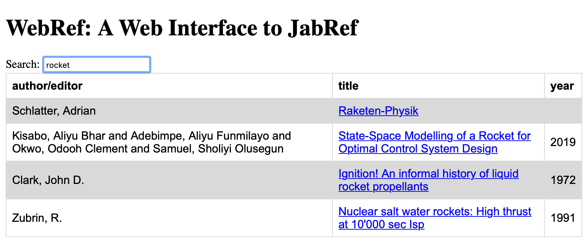

# ppf.webref

ppf.webref is a web app providing an interface to a [JabRef SQL
database](https://docs.jabref.org/collaborative-work/sqldatabase).
Access your references from anywhere in the world and from any device with a
web browser. You do not need to install Java, you do not need to install an
app. Any non-archaic phone, tablet, PC, Mac, or Raspberry Pi will do.

Create a JabRef database (using your normal JabRef) and point ppf.webref to
this database. Voila: Your references just became accessible worldwide.

Note: ppf.webref provides *read-only* access to your library. To add, edit, or
delete entries from your library, you still need a standard JabRef installation
somewhere.

<p align="middle">

</p>


## Installation

Prerequisite: You need JabRef to create, edit, and extend your library.

Install ppf.webref:

```shell
pip install ppf.webref
```

Then, tell ppf.webref about your database by adding a section as follows to
`~/.config/ppf.webref/ppf.webref.conf` (create it if it does not exist):

```
[flask]
secret_key = <your secret key here>

[database]
server = <server>:<port>
databasename = <name of your jabref database>
username = <username ppf.webref should use to access db>
password = <password ppf.webref should use to access db>
```

`secret_key` is needed to encrypt cookies. Set it to a random string, e.g. by
running this snippet:

```shell
python -c 'import secrets; print(secrets.token_hex())'
```

Finally, run

```shell
flask --app ppf.webref run
```

and point your webbrowser to http://localhost:5000.

[This will start ppf.webref on your local machine which is nice for testing.
To get the most out of ppf.webref, you will probably want to run ppf.webref on
a web server.]

ppf.webref will present a login form. However, as we have not created any users
yet, we can't login. To create a user, run:

```shell
flask --app ppf.webref useradd <username>
```

This will:

* create a table 'user' in your db if it does not exist, yet
* register user <username> in user table

To set a password for this new user or to change the password of an existing
user, do

```shell
flask --app ppf.webref passwd <username>
```

which will ask for and store (a salted hash of) the password in the
user table.

Now we are able to login.
